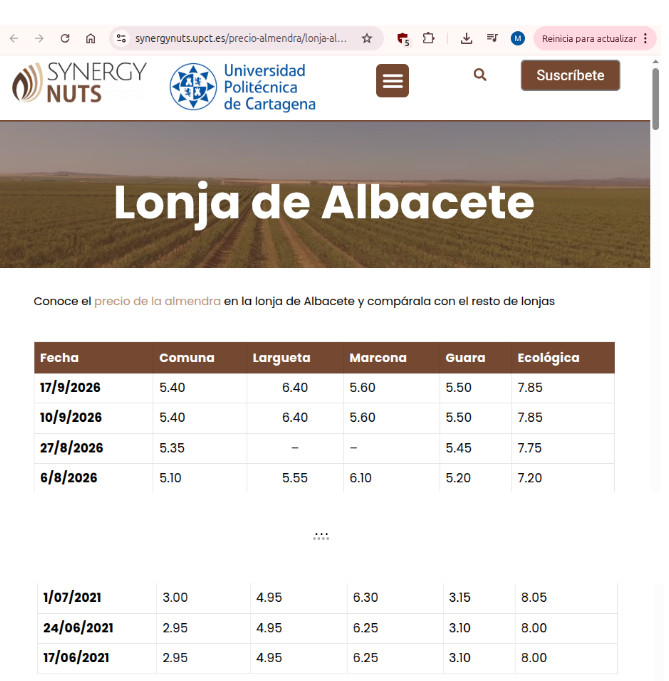

# IndicadorAlmendras

Marta Ruiz González

## El problema

Mis padres tienen una plantación de almendros de la variedad Lauranne. Es nueva,
llevan dos campañas cogiendo almendra. Toda la cosecha la venden de una vez, en
cáscara, a una cooperativa, que les paga según el rendimiento en pepita y el precio
de la almendra Comuna en la Lonja de Albacete (la Lonja de Albacete no cotiza la
Lauranne, así que la cooperativa la paga como Comuna).

El día de vender lo eligen ellos, y la almendra se puede guardar sin coste, así que
pueden esperar si quieren. El problema es cómo deciden ese día: venden "cuando el
precio está alto", pero eso lo saben sobre todo por lo que se comenta entre vecinos 
y otros agricultores del mismo pueblo, y alguna vez lo han mirado en alguna web. No
tienen ninguna forma de saber si el precio de esa semana está alto de verdad o 
solo lo parece.

Ya les ha pasado vender y que poco después el precio subiera sobre un 7 %. 
Como venden la cosecha de golpe, ese porcentaje se pierde sobre todo lo del año.
Además, la cosecha cambia mucho de un año a otro: el año pasado cogieron unos 
1000 Kg y este año 500 Kg por la helada, así que cuando hay poca almendra cada 
céntimo por kilo pesa.

## A quién le pasa

- Mis padres, que son con quien he hablado y de donde sale la idea.
- En mi familia todos tienen almendros, y les influye.
- En general pequeños agricultores de almendra que venden a una cooperativa,
    deciden ellos el día y se guían por lo que se comenta en el pueblo.
    
    
## Datos

- **Precios de mercado**: histórico semanal del precio de la almendra Comuna en la
    Lonja de Albacete, desde 17/06/2021 (en aquel entonces estaba por 2.95 €/kg).
    Fuente: [Synergynuts - Lonja de Albacete](https://synergynuts.upct.es/precio-almendra/lonja-albacete/).
    Los datos están en las tablas en la web, así que hay que extraerlos.
  Para sacarlos voy a leer el HTML de la página con mi propio código y quedarme con
esas dos columnas (Fecha y Comuna).
- **Ventas de mis padres**: los papeles de venta de la cooperativa de la campaña 
    del año pasado (la cosecha de este año está esperando a ver el precio más alto)
    que contienen fecha, kilos, rendimiento en pepita y precio.
    Son pocas ventas porque la plantación es nueva, pero sirven para cuantificar el 
    problema y comprobar que los cálculos cuadran con lo que les pagaron.

   Son las liquidaciones que les da la cooperativa cuando venden. De la campaña
   pasada hay 2 papeles, en foto. De cada uno saco la fecha de la centa, lso kilos
   en cáscara, el rendimiento en pepita y el precio pagado (€/kg).
   Con esto puedo comprobar que, con el precio de la Comuna de esa semana y el
   rendimiento, me sale lo que les pagaron de verdad.

Así es como vienen (copiado de la tabla, solo Fecha y Comuna):

## Por qué en la nube

Los precios de la lonja salen cada semana así que hay que ir recogiéndolos de forma
continua. Y quien lo tiene que consultar son mis padres, desde el movil y en el momento
en que están pensando si vender.

## Lógica de negocio

No basta con guardar y mostrar precios. Con los datos habría que:
- Comparar el precio de una semana con el de esas mismas semanas en otras campañas, 
    para saber si está alto o bajo de verdad.
- Analizar cómo suele moverse el precio en las semanas después de la cosecha.
- Calcular, con kilos y el rendimiento de mis padres, cuánto dinero se juegan según
    la semana en la que vendan.
    
    
## Referencias

Hay webs que publican precios de almendra de varias lonjas, como 
[Synergynuts](https://synergynuts.upct.es/precio-almendra/) o
[PrecioAlmendra.es](https://www.precioalmendra.es/). Dan el precio de cada semana,
pero no te dicen si ese precio es bueno comparado con otros años ni cuánto te juegas
tú con tu cosecha que es lo que mis padres no tienen.

## Lista de comprobación

* [X] ¿Se trata de un problema real del que se tenga conocimiento personal? Sí, es 
    la plantación de mis padres, lo he hablado con ellos.
* [X] ¿Se trata de un problema que para solucionar requiera el despliegue de una 
    aplicación en la nube? Sí, los precios salen cada semana y mis padres lo tienen 
    que consultar con el movil cuando van a vender.
* [X] ¿La solución requiere una cierta cantidad de lógica de negocio, en vez de
    solucionarse sólo almacenando y buscando? Sí, hay que comparar, analizar y 
    calcular con los precios, no sólo guardarlos.
* [X] ¿Se ha incluido la configuración del repositorio y se ha enlazado desde el
    `README`? Sí.
* [X] ¿Se ha incluido y enlazado correctamente la fotografía de la tarjeta del juego 
    de rol en el `README.md` subiéndola al repositorio? Sí.
* [X] ¿El estudiante tiene todos los datos necesarios para poder resolver el problema, 
    o va a requerir que el usuario los introduzca? Tengo los datos, el histórico de la
    Lonja de Albacete [Synergynuts - Lonja de Albacete](https://synergynuts.upct.es/precio-almendra/lonja-albacete/) y 
    los papeles de venta de mis padres. No hace falta que el usuario meta datos a mano.
* [ ] ¿Se está marcando al buen tuntún todo? No.

## Configuración del repositorio y juego de rol

[Ver configuración y juegos de rol](doc/configuracion.md) 

## Licencia

Este proyecto tiene licencia [GPL-3.0](LICENSE).
