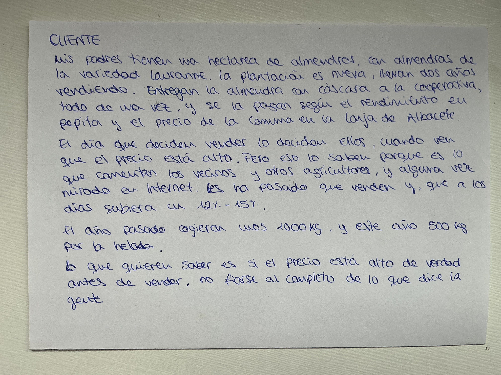
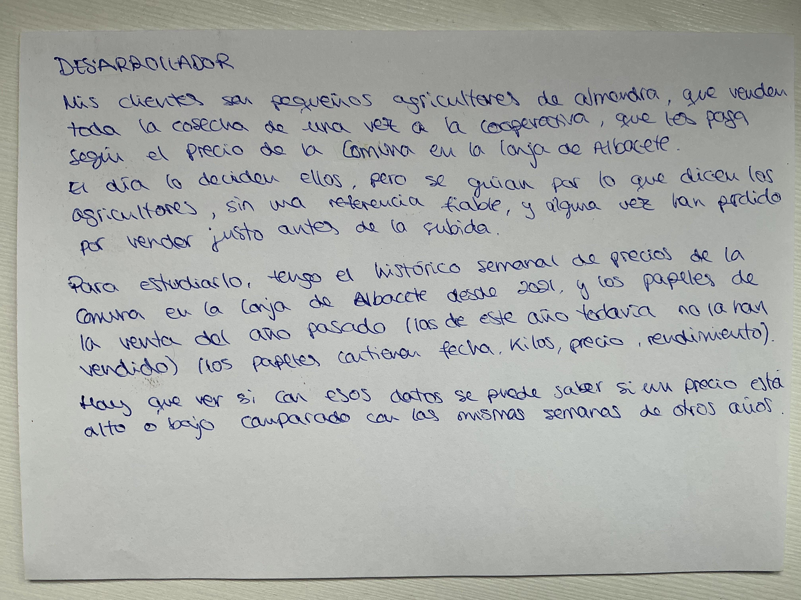
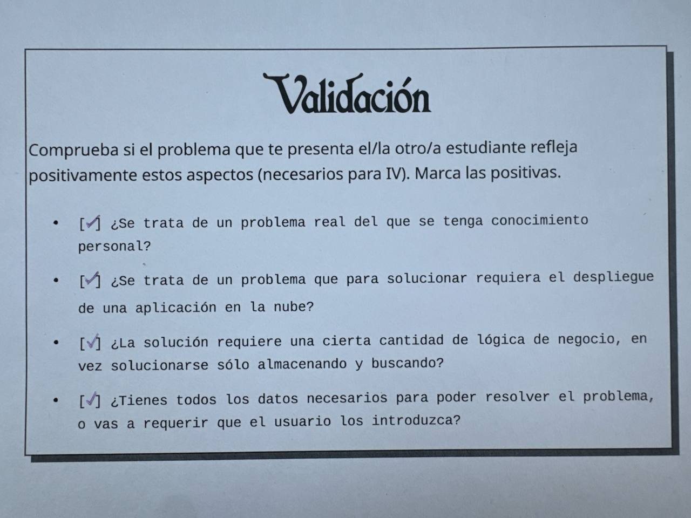
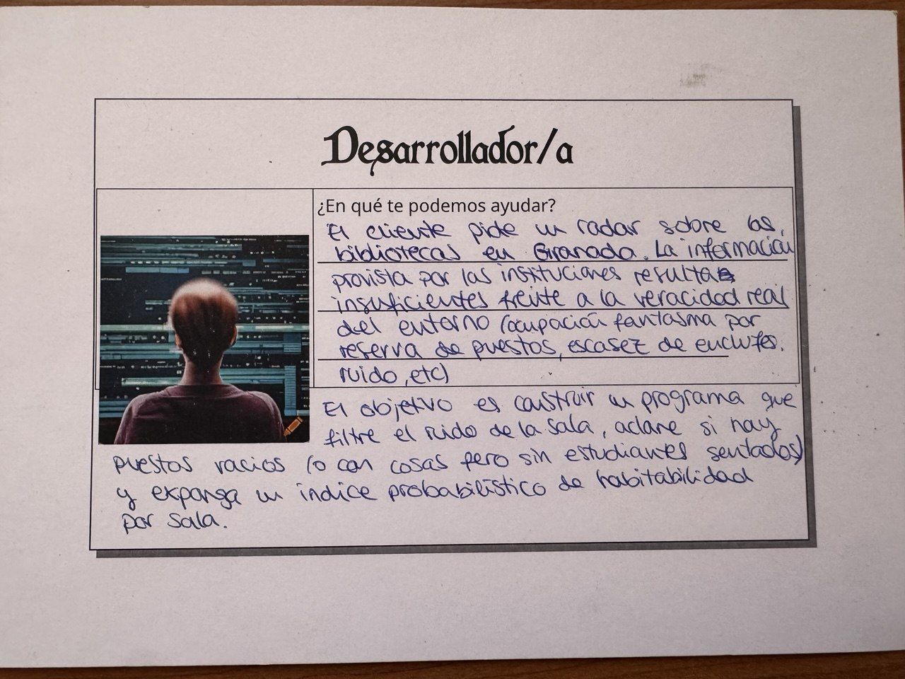

# Configuración del entorno de desarrollo y repositorio

En este documento detallo las decisiones y herramientas de configuración utilizadas para desarrollar el proyecto **IndicadorAlmendras**.

## 1. Identidad en Git
El cliente local de Git ha sido configurado con identidad única y verificable para asociar los commits a la autora del proyecto:
* `user.name`: Configurado con el nombre real de la estudiante.
* `user.email`: Configurado con el correo vinculado a la cuenta de GitHub.

## 2. Autentificación y conexión segura (SSH)
Para la sincronización con los repositorios remotos en GitHub se emplea exclusivamente autentificación mediante par de claves asimétricas SSH (`id_ed25519`):
* La clave pública se encuentra registrada en GitHub.
* Se rechaza el protocolo HTTPS y el uso de contraseñas en texto plano por motivos de seguridad y conforme a las directrices de la asignatura.

## 3. Perfil de GitHub
El perfil de GitHub tiene avatar propio (no el predeterminado), nombre y ciudad.

## 4. Licencia de Software Libre
El proyecto se distribuye bajo los términos de la licencia libre GPL-3.0 (fichero [`LICENSE`](../LICENSE) en la raíz del repositorio), garantizando la transparencia del código, la libre distribución y el cumplimiento de los estándares de software libre exigidos.

## 5. Gestión de exclusiones (.gitignore)
Se ha configurado un archivo `.gitignore` en la raíz para evitar el seguimiento de artefactos innecesarios en el control de versiones:
* Ficheros compilados e intermedios del intérprete (`__pycache__/`, `*.pyc`).
* Entornos virtuales (`.venv/`, `env/`).
* Ficheros temporales y de copia de seguridad generados por editores de texto en Linux (`*~`, `*.swp`).

## 6. Herramientas de gestión de entregas (git-iv)
Se ha integrado el plugin oficial `git-iv` en la ruta ejecutable local del sistema (`~/.local/bin/git-iv`) para automatizar la nomenclatura de ramas (`git iv objetivo N`) y el envío de cambios (`git iv sube-objetivo`). El plugin se usa desde el sistema y no forma parte del repositorio.

## 7. Juego de rol (design thinking): IndicadorAlmendras

## 8. Historial: primer problema (StudyRadar UGR)

[ESCRIBE AQUÍ CON TUS PALABRAS, 2-3 FRASES: que en el juego de rol de clase
trabajaste StudyRadar, que se descartó porque no había datos reales de
ocupación, ruido ni enchufes (aunque en la validación se marcó que sí), y que
por eso cambiaste al problema de la venta de almendra de tus padres.]

> **StudyRadar – Radar dinámico de ruido y aforo colectivo para estudiar**
>
> Soy el cliente y lo que quiero es tener a mano una solución definitiva al
> problema que tenemos todos los estudiantes en Granada cada cuatrimestre. Los
> estudiantes pasamos entre 8 y 10 h al día estudiando fuera de casa, sobre todo
> en periodo de exámenes. Mi problema no es saber dónde están las bibliotecas,
> el problema es que salgo de mi piso a ciegas. Necesito saber si me voy a
> encontrar una mesa útil cuando llegue en media hora. Con mesa útil me refiero a:
>
> 1. Enchufes
> 2. Nivel de ruido real
> 3. Efecto toalla y aforo engañoso
>
> Quiero un motor inteligente que haga:
> - Reportes regulares sobre: nivel de aforo estimado, disponibilidad de
>   enchufes y nivel de ruido.
> - Que me dé una recomendación personalizada.

> **¿En qué te podemos ayudar?**
> El cliente pide un radar sobre las bibliotecas en Granada. La información
> provista por las instituciones resulta insuficiente frente a la veracidad real
> del entorno (ocupación fantasma por reserva de puestos, escasez de enchufes,
> ruido, etc.).
>
> El objetivo es construir un programa que filtre el ruido de la sala, aclare si
> hay puestos vacíos (o con cosas pero sin estudiantes sentados) y exponga un
> índice probabilístico de habitabilidad por sala.

> Marcadas las cuatro casillas: problema real con conocimiento personal,
> requiere despliegue en la nube, requiere lógica de negocio y se tienen los
> datos necesarios.
